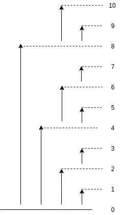

Best Tutorial - https://www.topcoder.com/thrive/articles/Binary%20Indexed%20Trees

Question variants of BIT - https://medium.com/@adityakumar_98609/fenwick-tree-binary-index-tree-aca7824d9c2a

Problem it solves - 
1. Efficient mutable range query operations on array/contionous set applicable on invertible operations like sum, multiplication etc. 
Beneficial when write operations are significant
2. Time complexity for range query and update - O(logN), Space complexity - O(N)


Intuition -
1. Any index(number) can be represented as sum of powers of 2. In the same manner, we can express a range ( 1 to x ) as the sum of other successive sub-ranges ( which are stored in sizes of powers of 2 )
Ex: sum(1,10) = sum(1, 8) + sum(9, 10) = sum(1, 2^3) + sum(2^3+1, 2^3 + 2^1) ... (10 in binary format - 01010)

2. Every index of original array is considered in multiple sum of grps based on binary repstn, this redundant grps of sum helps to reduce query time complexity to O(logN) but now also increase the time complexity for point updates from constant to O(logN)
Refer : 
Ex: index 6 in BIT array holds sum of (5 to 6 index in original array)

3. To calculate prefix sum till index idx its easy, sum the BIT index values considering the binary represtn of x
    ```
    loop until idx != 0:
        sum += BIT[idx]
        idx -= idx & (-idx) ... subtract left most significant bit(LMSB), easy way to find LMSB is considering bitwise and of number with its 2's complement.
    ```

4. Now to update index at idx, we need to ensure that in all grps of sum in BIT, the index we are updating..all those grps(BIT index) should be updated:
    ```
    loop until idx<= array.length:
        BIT[idx] = val
        idx += idx & (-idx)
    ```


Invertible operations - 
operations which have an inverse function such that when both function perform by same amount on a number gives same value. i.e: f'(f(x)) = x 
ex: 
1. ((x+2)-2) = x : addition and subtraction are inverse of each other
2. ((x*2)/2) = x : multiplication and division are inverse of each other
3. log, antilog

- Why invertible operations only for BIT range query? - to perform the range query in BIT, inverse operation b/w 2 prefix range value is performed.
Ex: for range sum query b/w [l,r] = range(1,r) - range(1,l) i.e '-' is an inverse operation on sum.
