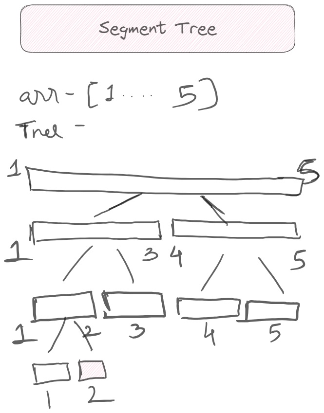
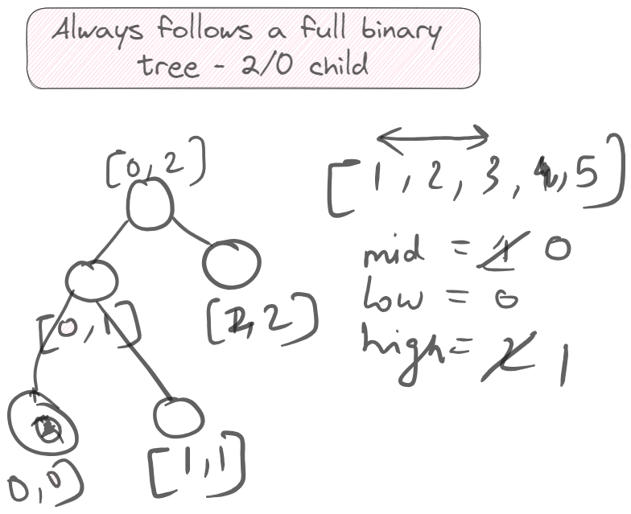

Board link : https://excalidraw.com/#json=CPttFPlnWauL0iX5rNs3L,7kzM_vgVsjrBWAvD75g3yg

<H4> Segment tree stores the range information in segments, starting from full array length then equally dividing each segment recursively forming a full binary tree. This overlapping segments redundancy helps to perform range queries faster. </H2>

<H4> Imp pts - </H4> 

1. Why the query/update time of segment tree is O(logN), given we traverse both parts of the tree recursively due to partial overlap(shouldn't that be O(N) then)?
- In segment tree, while traversing for query or update as there are 3 conditions - \
    i.  given query range fully overlaps current node range. \
    ii. given query range does not overlaps with current node range. \
    iii. given query range partially overlaps with current node range.
- Given above 3 conditions, for (i) and (ii) we will immediately return the value and will not traverse its subtree and for (iii) we traverse both of its subtree.
- Now for a given query range, the middle part of it will be covered with segments in intermidiate nodes and end parts will be either be covered in intermiediate segments or in worst case to cover end parts will need to traverse till leaf node.  
- Therefore, at max the tree traversal from root to leaf will be in 2 paths in worst case, which will cause the time-complexity as 2*O(logN) ~ O(logN)

2. It can be used efficiently only on static length of array. If we add / remove elements we need to rebuild the tree.

3. Segment tree is always a full binary tree / represented as full binary tree in array format. This is because we divide left and right subtree in equal half to keep the tree balanced and hence the size of tree as logN.

4. Always push the lazy updates to child nodes (to explicitly identify a particular change when multiple updates performed to same range consecutively and all updates to leaf node not propagated)
