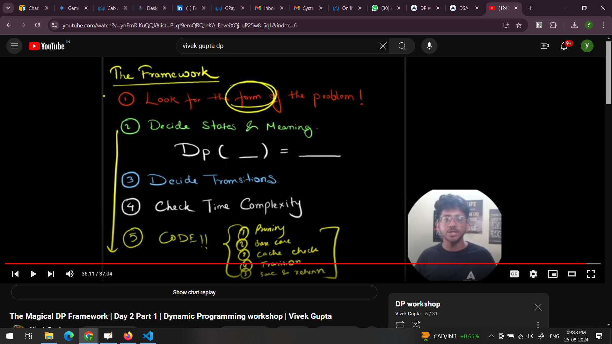
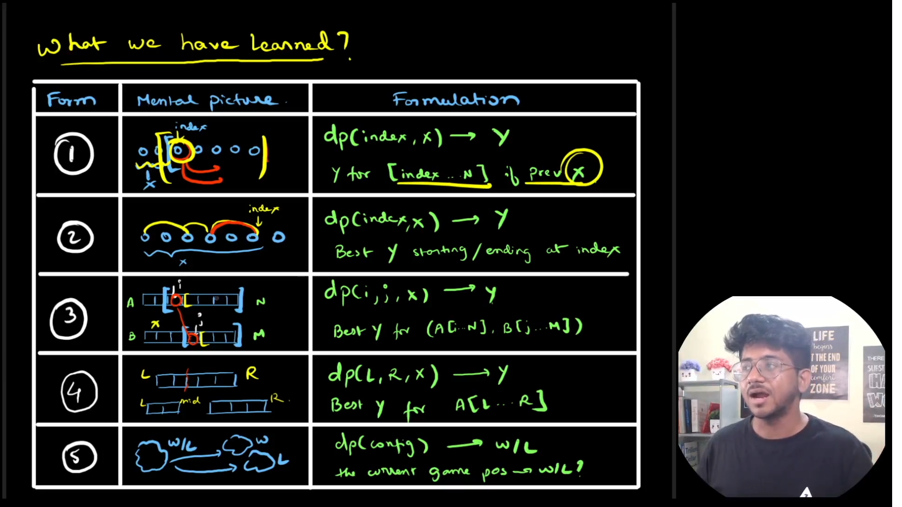

/*
notes:

- constraints in the problem makes a backtracking/recursive problem to be optimised as dp
(if it has overlapping sub-problem and optimal substructure).

- whenever there are multiple queries for same input, if we want to use the same dp array across the queries
then the dp array states should not have a parameter which directly changes with the each query (that makes dp array answers cached specific to that query)
ex: if subset sum equals K -
   There are 2 ways to formulate the states for this: 
   1. dp[array_index][sum_till_now] -> represents if from [array_index ... n] with already consumed sum as 'sum_till_now' a subset with sum K exists  
   2. dp[array_index][left] -> represents if from [array_index ... n] can we form a subset with sum 'left' 

*/

DP Framework:

1. Recognise DP form (patterns : 5 types in 90%) - form helps to formulate states and transition of states (choices) 
2. DP paramters to recursive function (states) and what are we computing (understand the meaning of recusion and dp) 
3. State transition modelling
4. Cache 
5. Time & space complexity check
   formula: (no of states)*(1 + no. of transitions) 
   we consider each transitions takes ~ O(1) in this case
5. Code

Form1: knapsack variation
1. overlapping sub-problem from all possible subsequence from (i,j) [any combination from (i,j), i.e non-contigous and elements can be skipped  + order of elements wrt original array not mandatory]  

2. states: are class/object in problem + constraints
dp(index/level, constraint_variable) - best ans from (index .... n) given constraint

3. transitions: dp(index, constraint_variable) 
   -> take
   -> not_take

Also known as knapsack variation
other problems -
a. find a subset sum equals K
b. climb stair

Form2: ending/starting at i  
1. overlapping sub-problem from all possible subsequence from (i,j) which includes j in all combination 
[i.e any combination from (i,j) including j, i.e non-contigous and elements can be skipped + order of elements wrt original array mandatory/not-mandatory]

2. states:
dp(index, constraint_optional) - best ans with combinations starting/ending at index(inclusion of index is mandatory in all combinations out of which best is selected to form this dp state)

3. transitions: 

Form3: multi-sequence dp

Form4: LR/Partition dp
1. overlapping sub-problem from all possible subarray from (i,j) [contigous combination from (i,j) with order maintained, i.e contigous and all elements considered + order of elements wrt original array mandatory]

start-end partitioning
merge partitions 

Form5: Game dp

Form summary:
