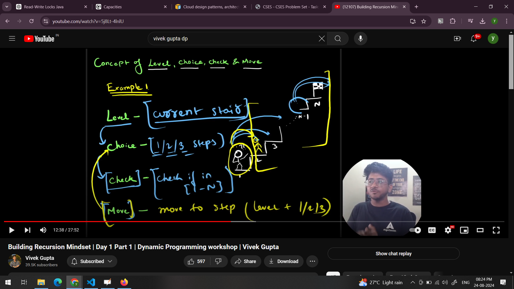

Recursion mental model / concept - 

- recursive implementation follows the principle of induction in mathematics

- The principle of mathematical induction consists of two steps:

1. Base Case: Prove that the statement is true for the smallest integer in the set you're considering (usually 1 or 0).
2. Inductive Step: Assume that the statement is true for an arbitrary integer k (the induction hypothesis). Then, prove that it's also true for k + 1.

Therefore, in recursive implementation assume the lower state (dependency) will always return correct value and we need to ensure the current state of recursion returns correct value.

Ex:
Fact(4) -> Fact(3) ..... -> Fact(0) [base case]

focus on one interaction in above recursive call for implementation - say Fact(4)->Fact(3)
Now based on induction principle- 
1. ensure Fact(4) computes correctly assuming Fact(3) (dependency here) returns correct value.

-----------------------------------------------------------------------------------------------------------------

Recursion framework -

1. Level: state (smallest component(s) in problem on which the combinations would be made) also considered as way to iterate all solution space effectively,

2. choice: for each level, what moves we can make to go to next level  

3. check: for each choice, check if the current partial solution is valid as per problem

4. move: if its a valid choice, evaluate that branch using recursion 

Ex:  
 
